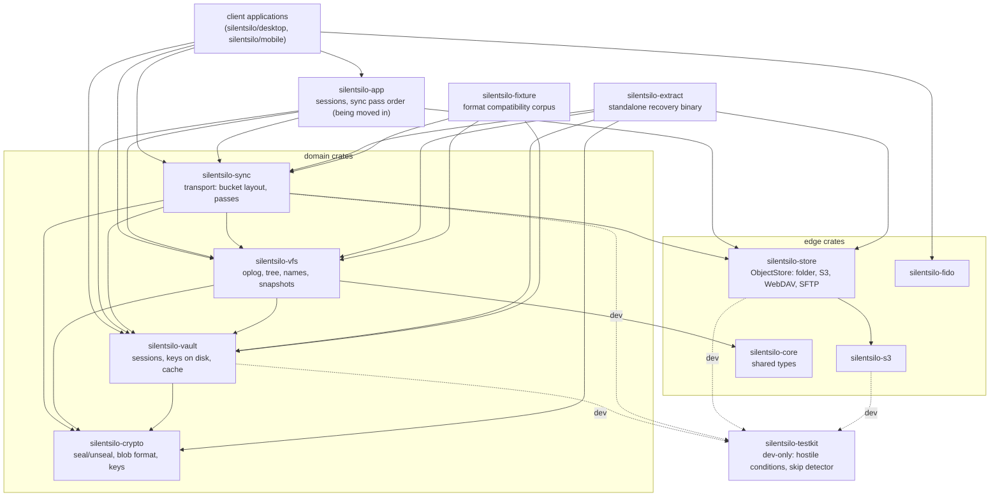
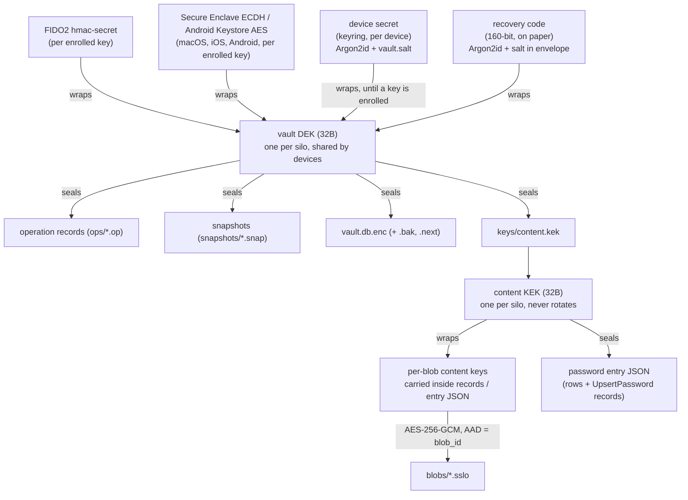
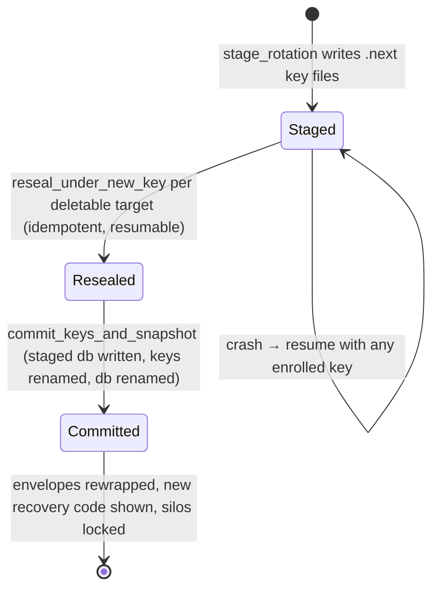
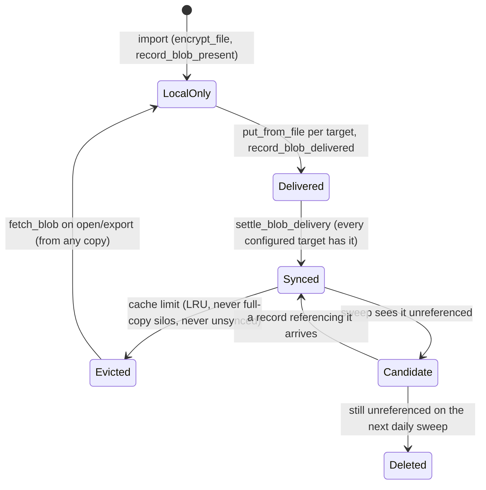

# Architecture map (core)

The working map of how a silo is built: the key hierarchy, the persisted
state, the operation log, and the invariants every change has to preserve.
Written for whoever changes this code next, human or tool.

This repository holds the domain crates, the persisted formats and the
standalone extraction tool. It knows nothing about a user interface. The
desktop application lives in
[silentsilo/desktop](https://github.com/silentsilo/desktop), and the parts of
the picture that belong to it, the sync pass order and the session and lock
lifecycle, are in that repository's own architecture map.

The other documents each own one slice: [FORMATS.md](../FORMATS.md) owns the
persisted bytes and [CRYPTO.md](CRYPTO.md) owns the cryptography as an
auditor reads it. This page owns the moving parts and the reasoning.

**Keep it true.** A change that alters anything described here updates this
page in the same commit. A stale map is worse than none: it answers with
confidence and it answers wrong.

## The one-paragraph model

SilentSilo is a local-first encrypted vault. There is no server. Every
change to the tree is an immutable, encrypted operation record appended to a
log; devices converge by exchanging records through dumb storage the user
owns (S3, WebDAV, SFTP, a folder). File content lives beside the log as
encrypted blobs, each under a key of its own. Everything a device shows is a
disposable cache rebuilt from the log; the log and the blobs are the only
things that matter, and the whole design bends around never losing either.

## Crate map

Dependency direction is the rule worth defending: nothing here knows about a
user interface, `silentsilo-sync` is transport and knows no UI,
`silentsilo-vfs` owns the model and knows no network, and
`silentsilo-crypto` knows nothing above bytes. Nothing in this repository may
depend on a client application or on its OS integration crate. CI enforces
that with the `no-ui-deps` job.

`silentsilo-app` is the application logic every client shares, moving in
from the desktop's command layer one area at a time: so far the session map,
closing a silo, the sync pass, the recovery and device key flows, and file
previews. A client gives it a `Host` for events, diagnostics and its saved
storage settings. The order and invariants of the pass are described in the
desktop repository's `docs/ARCHITECTURE.md` until the move is done, with one
two steps that exist only here so far: before pushing, the pass reconciles
the enrolled keys with `keys/` (`silentsilo-sync/key_sync.rs`, `FORMATS.md`),
and after pulling it imports the inbox (below).

The extract binary deliberately reuses the same crates rather than
reimplementing the read path: a second interpretation of the log is a second
thing that can be wrong.

## Key hierarchy

Why two layers under the DEK: a record's fingerprint covers its body, so
nothing inside a record can ever be rewritten. Content keys therefore hide
behind the KEK, and rotating the vault key re-wraps one KEK envelope plus
the DEK envelopes, touching no record and no blob. That is what makes
rotation affordable on a terabyte. The KEK itself never rotates; the DEK
does. Password entries seal under the KEK for the same reason: the
ciphertext travels inside records.

Rotation state machine (`silentsilo-vault/rotation.rs`, driven by the
client application):

The order is forced: the staged key is durable on disk before any object in
storage is re-sealed, because an object under a key that existed only in
memory is one nothing opens. Going backwards is never attempted; a second
rotation cannot be staged over a pending one. A device that was not kept in
the rotation is detected on its next pass, before it pushes: the published
KEK envelope only opens under the current DEK, and `key_still_current` turns
that into `needs_rejoin`. Without that gate, the stale device pushed records
nobody could read and overwrote the rotated KEK envelope with its own.

## Data at rest

Three distinct places, and the boundary between them is a security
property:

- **The silo folder** (user-chosen, portable, safe in a synced directory):
  only ciphertext. `vault.db.enc` and `.bak` (the index, sealed under the
  DEK), `vault.db.enc.next` (mid-rotation only), `blobs/*.sslo`,
  `vault.salt`, `master.dek.enc`, `keys/` (fido.json, recovery.json).
  Every irreplaceable file here is written atomically, temp then sync then
  rename (`workdir::write_private`), and a blob is synced to disk before the
  import returns: the record naming it can reach the bucket within seconds,
  and a truncated key file or a hollow blob after a power cut is a lockout
  or a permanently unopenable file.
- **The local secrets** (outside the folder): device credentials, storage
  settings and the silo list. Kept in the OS keyring where there is one,
  else in files. On Windows those files are DPAPI-wrapped; elsewhere a client
  may register a `LocalProtector` (Android: a Keystore key), and without one
  they are plaintext, private to the user or app.
- **The machine workdir** (keyed by silo path, outside the folder): the
  plaintext working copy `vault.db` with its WAL, decrypted files the user
  opened (`open/`), and `cache.db` (blob bookkeeping). Wiped on lock;
  adopted on unlock after a crash. Nothing here may ever land in the silo
  folder, or a silo in Dropbox uploads its index in the clear.
- **The bucket** (per target): `vault.json` (the only plaintext object, one
  random UUID), `ops/`, `blobs/`, `snapshots/`, `keys/*.env`,
  `keys/content.kek`, `recovery.env`. Layout and versions are FORMATS.md's
  jurisdiction.

Object keys sort meaningfully: op keys are
`ops/{lamport:020}-{device_id}-{op_id}.op`, so a plain listing is already in
apply order and both the Lamport value and the op id can be read without
downloading. Snapshot keys are the zero-padded horizon. Only `blobs/` keys
are immutable-by-key; everything else may be rewritten in place (rotation
re-seals, envelopes re-wrap), which is why seeding size-skips blobs alone
and copies the rest unconditionally.

## The operation log

State is a pure function of the record set. The total order is
`(lamport, device_id, op_id)`; replay sorts, so arrival order is
irrelevant. Alongside the Lamport value every record carries `seq` and
`prev`: a per-device hash chain that makes silently dropped or replaced
records detectable (`verify_chains`; see the gotchas for why it is not
wired). `emit` runs local changes through the same `apply_op` as remote
ones, inside one transaction with the Lamport reservation and the log row,
so the write path cannot drift from the replay path and a crash cannot
leave an effect without its record.

Name resolution is the subtle part. Uniqueness is per folder,
case-insensitive and Unicode-composed (`names::fold`). The `name_claims`
table records which operation claimed which name; ranks within a claim
group assign `name`, `name (2)`, and so on, as a pure function of the
record set. A suffixed name that another entry in the folder asked for
outright is skipped, so `report (2).pdf` given to a second `report.pdf`
never meets a file really called that. Subtree queries use `GLOB`, not
`LIKE`: `LIKE` folds ASCII case and would treat `x (2)` and `X (2)` as one
subtree. Typed names are validated (`names::check`) and NFC-composed at
the boundary; replayed names are repaired (`names::sanitize`) because a
record can never be refused. Concurrent edits of one file resolve by total
order, with the loser preserved as a deterministic conflict copy (id
derived from the losing record via UUIDv5, carrying the losing content's
wrapped key).

## Compaction

A snapshot at a chosen Lamport horizon stands in for every record at or
below it. `choose_horizon` keeps a time margin (30 days, from untrusted
timestamps) and a count margin (500 records, which holds when a clock
lies), never splits a Lamport value, and only the device that has just
synced everything may compact. Order, one way only: capture, publish the
snapshot to every target, read it back and refuse to prune unless the bytes
in storage are the bytes written (it is about to become the only copy of
everything below the horizon), delete covered ops from targets that allow
it, prune locally (unpushed records are never dropped and are reported as
stranded). A device that falls below the horizon gets `needs_rebuild` and
comes back via the snapshot with a fresh device id, because its old chain
positions died with the log. Append-only targets keep their whole log and
still receive the snapshot, which is what a joining device replays from.

## Blob lifecycle

The referenced set is `files.blob_id` (trash included, a restore needs the
bytes) plus password attachment blobs parsed out of the decrypted entries,
because attachments have no row anywhere; the sealed entry is their only
reference (`Vfs::referenced_blobs_with_attachments`). Purge and attachment
removal clean the local cache only; the bucket copy is always the sweep's
to delete, because the sweep re-asks after the ops have converged, and a
row written concurrently on another device may still need the bytes. All
transfers stream through disk (`put_from_file`/`get_to_file`); nothing
holds a whole blob in memory.

### The inbox

A device that cannot open the silo sends content to `inbox/`, and an
unlocked device imports it (`silentsilo-sync/src/inbox.rs`, formats in
`FORMATS.md`). The import copies the item into `blobs/` before it records
the file and deletes the item only after. Nothing waiting may live under
`blobs/`: the sweep would delete it after two passes, on any version.

In `silentsilo-app` the import runs after the pull and before housekeeping.
An item recorded in one pass leaves the inbox in a later pass, and only when
that pass reached every configured target: the record is pushed at the start
of the pass after the one that wrote it, so the item is never gone from
storage while the only trace of it is one device's database. An archive
target keeps its items; they are skipped as already known. With more than one
target the importer fetches the content down, so its next push spreads it to
the targets the phone did not send to.

Several unlocked devices import the same items at once, and nothing stops
that. What keeps them agreeing:

- the file id is the item id, and the folders the import creates take ids
  derived from parent and name (`Vfs::ensure_folder_path`), so both devices
  write the same file into the same folder. Random folder ids made a
  "(2)" folder, and each device kept the files in its own;
- content already in `blobs/` at the signed size is not copied again;
- an item another device finished between the listing and the read is
  skipped, not an error that stops the scan;
- before an item leaves the inbox its content is checked in `blobs/` and
  copied again when missing. A device that recorded an item and stayed locked
  for days can find that copy swept by another device, which does not know
  the file yet.

## Recovery matrix

What gets someone out of which hole, all of it built from the same pieces
(`fetch_join_plan` picks snapshot-plus-tail or whole log by asking the
bucket):

| Situation | Way out |
|---|---|
| Lost the security key, machine fine | `vault_unlock_with_recovery` (code, local or bucket envelope) |
| Machine gone entirely | `vault_join_with_recovery`, or a key on a new machine via `vault_join_from_storage` |
| Machine gone, project gone | `silentsilo-extract`: files, trash to one side, passwords as CSV, attachments |
| Local index corrupt beyond both snapshots | `vault_repair_from_storage`, offered by the unlock screen, in place, blobs kept |
| Device below the compaction horizon | `vault_rebuild_from_snapshot` (any copy that holds one), fresh device id |
| Device rotated away | `needs_rejoin`: remove and rejoin with a current credential |
| Bit rot in a copy | `vault_verify` deep read; a damaged object re-uploads from another copy or the local cache on later passes |

## Looks wrong, is deliberate

Read this before "fixing" any of it.

- **`verify_chains` is never called.** Wiring it naively false-positives on
  every rebootstrapped device, whose new chain legitimately starts above
  zero from the fetcher's point of view. It waits for a checkpoint design.
- **`derivation` on key envelopes decides more than it looks.** It shipped
  before anything varied, as groundwork for platform authenticators, and the
  macOS build is the first to use it: `ecdh-p256-hkdf-sha256-v1` alongside
  `hmac-secret-v1`. Every device reads every other device's envelopes, and a
  device skips the ones whose derivation it cannot perform. Mobile will add
  to the list rather than change it.
- **Purge does not delete bucket blobs.** The sweep does, two-pass, after
  convergence. Deleting at purge time froze "referenced" at what one device
  knew and destroyed content another device still pointed at.
- **Seeding size-skips only `blobs/`.** Everything else is rewritten in
  place at identical length by rotation, so "same key, same size" would
  skip the one write that matters.
- **S3 HEAD treats 403 as absent.** A prefix-scoped credential gets 403 for
  a missing key; callers use HEAD to decide whether to write, writes are
  idempotent, and a genuinely bad credential fails loudly on PUT.
- **`SetDeviceLabel` and `AnnounceDevice` are separate ops** so a machine
  re-announcing its hostname can never overwrite a name a person typed.
  Empty label means "no label", deliberately.
- **`settle_delivery([])` marks everything unpushed.** No targets means no
  copy holds anything, and compaction must not prune on the strength of
  copies that no longer exist. Same shape for blobs.
- **`fetch_blob` does not mark the blob evictable** even though it plainly
  came from a target: eviction needs every target to hold it and this call
  knows only one. The next pass settles it.
- **`is_skippable` is a per-variant decision**, carried on the record,
  because it is all an older build has to go on when it meets an operation
  from a newer one. Decoration skips; structure refuses.
- **`MAX_OP_BYTES` rejects from the listing**, before download: storage is
  untrusted and an object sized to exhaust memory must never be fetched.
  Same posture as the Argon2 parameter ceiling on `recovery.env`.
- **Recovery codes map O→0, I/L→1, U→V on input.** Crockford's alphabet
  excludes those on output precisely because handwriting confuses them;
  strict parsing would reject correct codes.

## Changing things

The checklist, in order:

1. **Does it touch a persisted format?** The list is in FORMATS.md, and the
   question to answer is what a client on the previous release does with the
   new bytes. Only two answers are acceptable, and they must be true by test:
   it ignores the new thing safely, or it refuses explicitly and tells the
   user to update. Anything else needs a version field first. There is an
   installed base from 1.0.0 onward, so this is never theoretical.
2. **Does it change what replay produces?** Then every device must produce
   the same result from the same records, in any order, and a test proving
   both orders belongs next to the change. The derived tables are dropped and
   rebuilt from the local oplog, which is what makes schema changes free:
   never add an in-place SQLite migration.
3. **Does it touch delivery, eviction, sweeping or compaction?** State the
   invariant it preserves: nothing is marked sent before storage confirms;
   nothing local is dropped unless every copy holds it; nothing in a bucket
   is deleted unless it is covered by a snapshot or unreferenced across two
   sweeps.
4. **Run the whole CI sequence locally, from the workspace root**, in the
   order `.github/workflows/ci.yml` runs it. The cargo commands need `--all`
   from the root or they silently skip crates. Add
   `cargo test -p silentsilo-fixture` when replay or formats moved: a fixture
   whose decoded output changes is a break, not a fixture to update.

   Anything touching a storage backend goes through
   `scripts/test-local.ps1`, which brings up MinIO, WebDAV and SFTP in
   containers and runs the same sequence with the endpoints set. Those
   suites skip themselves without an endpoint, so on a developer machine
   they otherwise never run at all. That script sets
   `SILENTSILO_TEST_REQUIRE_BACKENDS`, which turns
   `silentsilo_testkit::skip_or_fail` from a printed line into a failure:
   a suite that skips itself during a run that asked for it is a hole, not
   a note.
5. **Does it change a write the app cannot afford to lose?** Then it belongs
   in `silentsilo-vault/tests/hostile_environment.rs`, which runs each of
   those writes with something holding the destination open and with the temp
   path blocked. A clean temporary directory is not the machine the app runs
   on: the worst defect found so far was a temp-then-rename that a scanner's
   open handle refused, and no test in the suite held anything open.
6. **Does a client have to change with it?** A release here is a tag, and
   `silentsilo/desktop` pins one. Say so in the release notes; the client
   moves its pin deliberately, which is the moment the two are tested
   together.
7. **Update this page and FORMATS.md in the same commit** when behavior they
   describe moves.
